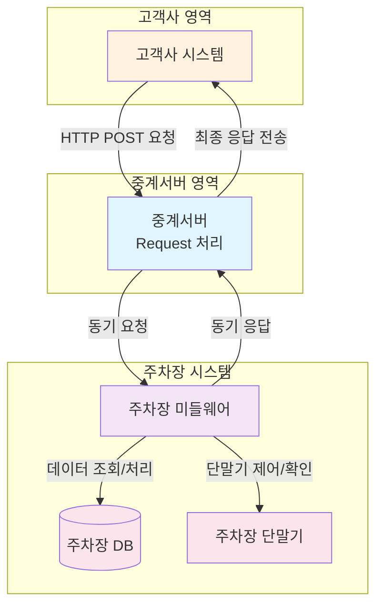
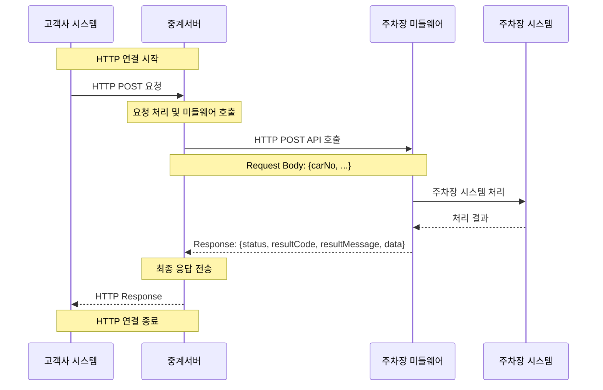

# 중계서버-미들웨어 API 통합 문서

## 📋 목차
1. [시스템 개요](#시스템-개요)
2. [API 호출 플로우](#api-호출-플로우)
3. [API 상세 규격](#api-상세-규격)
4. [에러 코드](#에러-코드)
5. [예제](#예제)

---

## 🏗️ 시스템 개요

### 연동 목적

이 문서는 **외부 고객사의 주차장 시스템과의 원활한 연동**을 위해 중계서버와 미들웨어 간의 통신 방식을 표준화하고, 데이터 교환 프로토콜을 정의합니다. 

주차장 운영의 핵심 기능인 **입차 조회**, **요금 계산**, **할인권 관리** 등의 업무를 동기 처리 방식으로 안정적으로 수행하는 것을 목표로 합니다.

### 전체 시스템 아키텍처



### 주요 특징
- **중계서버 ↔ 미들웨어**: 동기 처리 (Request-Response 방식)
- **미들웨어**: 주차장 DB 및 단말기와의 통신 담당
- **모든 API**: HTTP POST 방식으로 호출
- **응답**: 즉시 처리 결과 반환

---

## 🔄 API 호출 플로우

### 대표적인 API 호출 시퀀스



---

## 📋 API 상세 규격

### 1. 입차 조회 API

#### API 엔드포인트
- **URL**: `POST /incar/search`
- **설명**: 차량번호로 입차 정보를 조회합니다. (전체 차량번호 또는 4자리로 검색 가능)

#### 📥 Request (중계서버 → 미들웨어)
| 필드명 | 타입 | 필수 | 설명 | 예시 |
|--------|------|------|------|------|
| carNo | string | N* | 차량번호 (전체) | "12가3456" |
| carNo4 | string | N* | 차량번호 (4자리) | "3456" |
| carNoN | string | N* | 차량번호 (숫자만) | "123456" |

> **참고**: `carNo`, `carNo4`, `carNoN` 중 **반드시 하나는 필수**입니다. 3가지 모두 없거나 2개 이상 동시에 전송하면 안됩니다.

```json
{
  "carNo": "12가3456"
}
```

#### 📤 Response (미들웨어 → 중계서버)
```json
{
  "status": "200",
  "resultCode": "success",
  "resultMessage": "정상 처리되었습니다.",
  "data": {
    "inCar": [
      {
        "inCarDt": "20150710",
        "inCarSeqNo": "000001",
        "carNo": "11가1234",
        "carNo4": "1234",
        "inCarTm": "090000",
        "inParkCustTy": "1",
        "inNiceMacNo": "COW211"
      }
    ]
  }
}
```

> **참고**: `inCar`는 입차 정보 배열입니다. 입차 중 차량만 조회되며, 차량번호 4자리 중복 시 여러건 조회됩니다.

---

### 2. 요금 조회 API

#### API 엔드포인트
- **URL**: `POST /incar/calc`
- **설명**: 입차 정보를 기반으로 주차 요금을 계산합니다.

#### 📥 Request (중계서버 → 미들웨어)
| 필드명 | 타입 | 필수 | 설명 | 예시 |
|--------|------|------|------|------|
| inCarDt | string | Y | 입차일자 (YYYYMMDD) | "20150710" |
| inCarSeqNo | string | Y | 입차순번 | "000001" |
| outScheduledTm | string | Y | 출차예정시간 (YYYYMMDDHHMMSS) | "20250714170000" |
| discountInfo | array | N | 할인권 정보 배열 | - |

**discountInfo 배열 구조**
| 필드명 | 타입 | 필수 | 설명 | 예시 |
|--------|------|------|------|------|
| discountMtd | string | Y | 할인방식 | "C" |
| discountTkKnd | string | Y | 할인권종류 | "10000010" |
| webDiscountRegSeq | string | Y | Web할인등록순번 | "0001" |
| discountNumber | string | Y | 할인번호 | "discount123456" |

```json
{
  "inCarDt": "20150710",
  "inCarSeqNo": "000001",
  "outScheduledTm": "20250714170000",
  "discountInfo": [
    {
      "discountMtd": "C",
      "discountTkKnd": "10000010",
      "webDiscountRegSeq": "0001",
      "discountNumber": "discount123456"
    }
  ]
}
```

#### 📤 Response (미들웨어 → 중계서버)
```json
{
  "status": "200",
  "resultCode": "success",
  "resultMessage": "정상 처리되었습니다.",
  "data": {
    "inCarDt": "20150710",
    "inCarSeqNo": "000001",
    "carNo": "11가1234",
    "inCarTm": "090000",
    "outScheduledTm": "20250714170000",
    "originalParkChrg": 5000,
    "discountChrg": 3000,
    "parkChrg": 2000,
    "discountInfo": [
      {
        "discountMtd": "C",
        "discountTkKnd": "10000010",
        "webDiscountRegSeq": "0001",
        "discountNumber": "discount123456",
        "discountAmt": 3000,
        "remark": "비고"
      }
    ]
  }
}
```

> **참고**: `discountInfo`는 할인권 정보 배열입니다. 여러 개의 할인권이 적용된 경우 배열에 추가됩니다.

---

### 3. 할인권 등록 API

#### API 엔드포인트
- **URL**: `POST /incar/discount/add`
- **설명**: 주차 할인권을 등록합니다.

#### 📥 Request (중계서버 → 미들웨어)
| 필드명 | 타입 | 필수 | 설명 | 예시 |
|--------|------|------|------|------|
| inCarDt | string | Y | 입차일자 (YYYYMMDD) | "20150710" |
| inCarSeqNo | string | Y | 입차순번 | "000001" |
| discountMtd | string | Y | 할인방법 | "C" |
| discountTkKnd | string | Y | 할인권종류 | "10000010" |
| discountNumber | string | Y | 할인번호 | "discount123456" |
| discountApplyDt | string | Y | 할인적용일자 (YYYYMMDD) | "20250704" |
| discountApplyTm | string | Y | 할인적용시간 (HHMMSS) | "090000" |
| remark | string | N | 비고 | "비고" |

```json
{
  "inCarDt": "20150710",
  "inCarSeqNo": "000001",
  "discountMtd": "C",
  "discountTkKnd": "10000010",
  "discountNumber": "discount123456",
  "discountApplyDt": "20250704",
  "discountApplyTm": "090000",
  "remark": "비고"
}
```

#### 📤 Response (미들웨어 → 중계서버)
```json
{
  "status": "200",
  "resultCode": "success",
  "resultMessage": "정상 처리되었습니다."
}
```

---

### 4. 할인권 조회 API

#### API 엔드포인트
- **URL**: `POST /incar/discount/search`
- **설명**: 등록된 할인권 정보를 조회합니다.

#### 📥 Request (중계서버 → 미들웨어)
| 필드명 | 타입 | 필수 | 설명 | 예시 |
|--------|------|------|------|------|
| inCarDt | string | Y | 입차일자 (YYYYMMDD) | "20150710" |
| inCarSeqNo | string | Y | 입차순번 | "000001" |

```json
{
  "inCarDt": "20150710",
  "inCarSeqNo": "000001"
}
```

#### 📤 Response (미들웨어 → 중계서버)
```json
{
  "status": "200",
  "resultCode": "success",
  "resultMessage": "정상 처리되었습니다.",
  "data": {
    "discountInfo": [
      {
        "discountMtd": "C",
        "discountTkKnd": "10000010",
        "webDiscountRegSeq": "0001",
        "discountNumber": "discount123456",
        "remark": "비고"
      }
    ]
  }
}
```

> **참고**: `discountInfo`는 할인권 정보 배열입니다. 등록된 모든 할인권 정보가 배열 형태로 반환됩니다.

---

### 5. 할인권 삭제 API

#### API 엔드포인트
- **URL**: `POST /incar/discount/delete`
- **설명**: 등록된 할인권을 삭제합니다.

#### 📥 Request (중계서버 → 미들웨어)
| 필드명 | 타입 | 필수 | 설명 | 예시 |
|--------|------|------|------|------|
| inCarDt | string | Y | 입차일자 (YYYYMMDD) | "20150710" |
| inCarSeqNo | string | Y | 입차순번 | "000001" |
| discountNumber | string | Y | 할인번호 | "discount123456" |

```json
{
  "inCarDt": "20150710",
  "inCarSeqNo": "000001",
  "discountNumber": "discount123456"
}
```

#### 📤 Response (미들웨어 → 중계서버)
```json
{
  "status": "200",
  "resultCode": "success",
  "resultMessage": "정상 처리되었습니다."
}
```

---

### 공통 필드 구조

#### Response 공통 필드
모든 API 응답에는 다음 필드가 포함됩니다:
- `status`: 상태 (SUCCESS/ERROR)
- `resultCode`: 결과 코드
- `resultMessage`: 결과 메시지
- `data`: 실제 업무 데이터 (선택적)

---

## 💡 예제

### 입차 조회 예제

#### 📥 중계서버 요청
```bash
curl -X POST https://middleware.example.com/incar/search \
  -H "Content-Type: application/json" \
  -d '{
    "carNo": "11가1234"
  }'
```

#### 📤 미들웨어 응답
```json
{
  "status": "200",
  "resultCode": "success",
  "resultMessage": "정상 처리되었습니다.",
  "data": {
    "inCar": [
      {
        "inCarDt": "20150710",
        "inCarSeqNo": "000001",
        "carNo": "11가1234",
        "carNo4": "1234",
        "inCarTm": "090000",
        "inParkCustTy": "1",
        "inNiceMacNo": "COW211"
      }
    ]
  }
}
```

---

## 🔧 개발 가이드

### 1. 날짜/시간 형식
- 날짜: `YYYYMMDD` (예: 20241201)
- 시간: `HHMMSS` (예: 153000)

### 2. 동기 처리 고려사항
- 모든 API는 동기 처리 방식
- 응답 타임아웃: 30초
- 네트워크 오류 시 재시도 로직 구현 권장

### 3. 에러 처리
- HTTP 상태 코드와 resultCode 모두 확인
- 네트워크 오류 시 재시도
- 응답 미수신 시 타임아웃 처리

---
